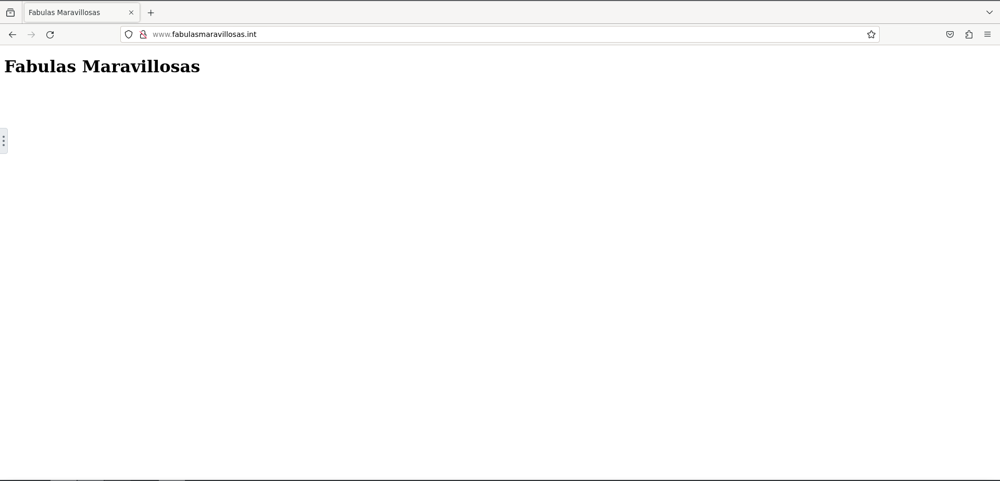
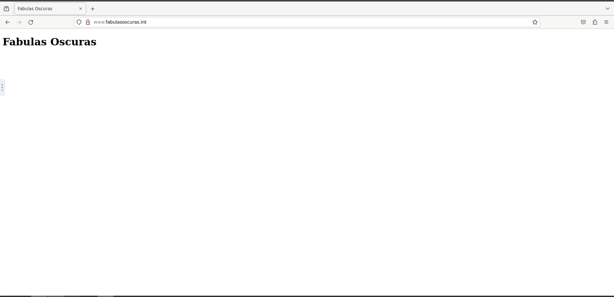

# **SRI** :kissing_closed_eyes:
## Instalación de Apache+Virtual Host

### 1. DNS
Primero tendremos que añadir y configurar nuestro servidor DNS con una imagen BIND9, podremos ver como esta configurado en el docker-compose.
El codigo para crearlo será el siguiente:
```yaml
  bind9:
    container_name: web_bind9
    image: ubuntu/bind9
    platform: linux/amd64
    networks:
      network:
        ipv4_address: 172.28.0.40
    ports:
      - '53:53/tcp'
      - '53:53/udp'
    volumes:
      - ./dns/conf/:/etc/bind/
      - ./dns/zones/:/var/lib/bind/
```
### 2. Configurar IPs del DNS y del apache

La configuracion del DNS se vio en el punto anterior, la configuración de la IP del apache será la siguiente:
```yaml
asir_web1:
    image: httpd:2.4
    ports:
      - "58080:80"
    volumes:
      - ./paginas:/usr/local/apache2/htdocs
      - ./conf:/usr/local/apache2/conf
    container_name: asir_web1
    networks:
      network:
        ipv4_address: 172.28.0.30
```

### 3. Hacer que resuelva dos dominios en un mismo servidor DNS.

Para ello tendremos que configurar dos zonas diferentes pero con la misma ip. Aqui mostrare el named.conf.local, con las zonas, y las respectivas bases de datos de la carpeta zone:

**named.conf.local**
```yaml
zone "fabulasoscuras.int" {
	type master;
	file "/var/lib/bind/db.fabulasoscuras.int";
	allow-query {
		any;
		};
	};
zone "fabulasmaravillosas.int" {
	type master;
	file "/var/lib/bind/db.fabulasmaravillosas.int";
	allow-query {
		any;
		};
	};
```
**db.fabulasoscuras.int**
```yaml
$TTL 38400	; 10 hours 40 minutes
@		IN SOA	ns.fabulasoscuras.int. igorrita.danielcastelao.org. (
				20231121   ; serial
				10800      ; refresh (3 hours)
				3600       ; retry (1 hour)
				604800     ; expire (1 week)
				38400      ; minimum (10 hours 40 minutes)
				)
@		IN NS	ns.fabulasoscuras.int.
ns		IN A 	172.28.0.40
www     IN A    172.28.0.30
```
**db.fabulasmaravillosas.int**
```yaml
$TTL 38400	; 10 hours 40 minutes
@		IN SOA	ns.fabulasoscuras.int. igorrita.danielcastelao.org. (
				20231121   ; serial
				10800      ; refresh (3 hours)
				3600       ; retry (1 hour)
				604800     ; expire (1 week)
				38400      ; minimum (10 hours 40 minutes)
				)
@		IN NS	ns.fabulasmaravillosas.int.
ns		IN A 	172.28.0.40
www     IN A    172.28.0.30
```

### 4. Configurar virtualhost en apache
Los archivos virtualhost seran los siguientes, son los que haran que a cada dominio le aparezca el contenido correspondiente:
```html
<VirtualHost *:80>
ServerName www.fabulasmaravillosas.int
DocumentRoot /usr/local/apache2/htdocs/fabulasmaravillosas
</VirtualHost>
<VirtualHost *:80>
ServerName www.fabulasoscuras.int
DocumentRoot /usr/local/apache2/htdocs/fabulasoscuras
</VirtualHost>
```
### 5. Comprobación

